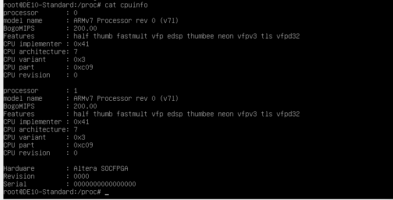
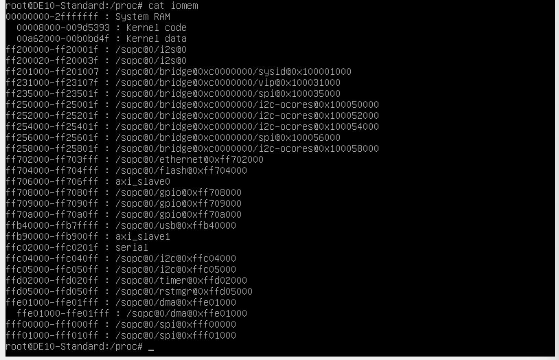
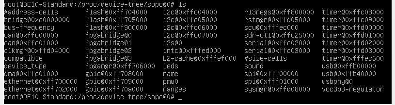
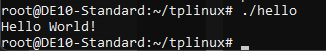
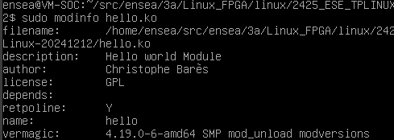
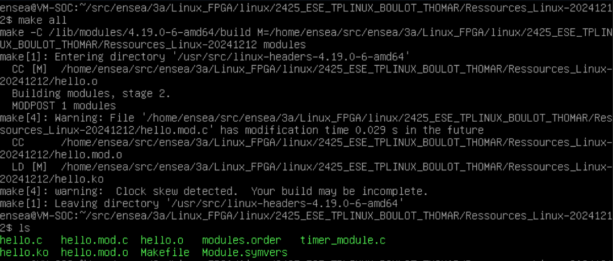
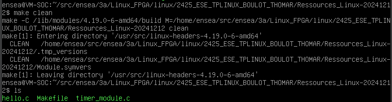
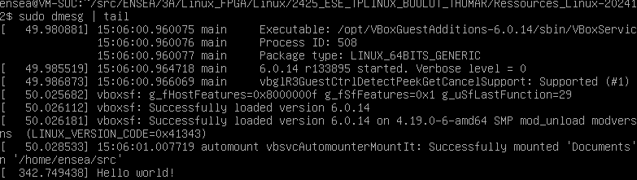
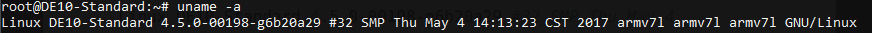
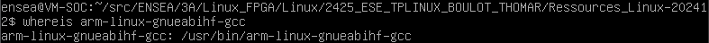

# 2425_ESE_TPLINUX_BOULOT_THOMAR

### 1.3 Connexion au système

## 1.3.2 Utilisez un logiciel de liaison série

L’image copiée précédemment n’occupe pas la totalité de la carte SD. Quelle est la taille occupée ?
<p align="center">  </p>
Comme on peut le voir, seulement 3 Go de la carte SD sont occupés. (/dev/root)

Vérifiez que vous avez bien 32GB de disponible sur la carte SD.
<p align="center">  </p>
Comme on peut le voir, on utilise désormais 14GB sur la carte. (notre carte SD fait 16GB)

## 1.3.3 Configuration réseau

### 1.4 Découverte de la cible

## 1.4.1 Exploration des dossiers /sys/class et /proc

cat cpuinfo donne les informations sur les processeurs présents sur la cible.
<p align="center">  </p>

cat ioports ne montre rien car le fichier est vide sous linux.


cat iomem montre ce qui est présent dans la mémoire en nous précisant l'adresse et ce qu'elle contient :
<p align="center">  </p>
Ce fichier donne une vue de la mémoire mappée, y compris les adresses mémoire utilisées par les périphériques.

Le répertoire /proc/device-tree/sopc@0 contient la structure de données décrivant les périphériques d’une machine :
<p align="center">  </p>
Le device tree est utile pour les périphériques non découvrables ou énumérables et permet aussi d'éviter beaucoup de code redondant pour décrire les périphériques.

## 1.4.2 Compilation croisée

On préfère compiler sur notre pc plutôt que sur le gcc du SoC pour une question de performance. On utilise donc une compilation croisée, les programmes sont compilée sur notre pc et on copie juste l'executable sur le SoC.

## 1.4.3 Hello world !

Code du Hello world
```C
#include <stdio.h>

int main(void){
    printf("Hello World!\n");
    return 0;
}
```
<p align="center">  </p>

## 1.4.5 Chenillard (Et oui, encore !)

Code du chenillard
```C
#include <stdio.h>
#include <unistd.h>

int main() {
    int index_fichier_max = 9;
    char path[64];  
    while(1){

        for (int i = 1; i <= index_fichier_max; i++) {    //on commence à la led 1 car la led 0 clignote déjà
            
            snprintf(path, sizeof(path), "/sys/class/leds/fpga_led%d/brightness", i);

            // Exemple d'ouverture et de fermeture du fichier
            FILE * outfile = fopen(path, "w");
            if (outfile == NULL) {
                perror("Erreur lors de l'ouverture du fichier");
                continue;  // Passer au fichier suivant si erreur
            }

            // Ecriture dans le fichier

            fprintf(outfile, "1");  // Allumer la LED (1)
            fclose(outfile);
            usleep(50000);

            outfile = fopen(path, "w");
            fprintf(outfile, "0");  // Eteindre la LED (0)
            fclose(outfile);
            usleep(50000);      
        }
    }
    return 0;
}
```

### 2.1 Accès aux registres

Code permettant d'allumer la 8ème led du SoC en utilisant les registres
```C
#include <stdio.h>
#include <stdint.h>
#include <unistd.h>
#include <sys/mman.h>
#include <fcntl.h>

int main(){
    
    uint32_t * p;
    int fd = open("/dev/mem", O_RDWR); // ouvrir la mémoire
    p = (uint32_t *) mmap(NULL, 4, PROT_WRITE|PROT_READ, MAP_SHARED, fd, 0xFF203000);
    *p = (1<<8); // allumer led 8
    return 0;
}
```
Depuis l'espace utilisateur, le programme ne peut pas modifier tous les registres et son espace mémoire est limité.

### 2.2 Compilation de module noyau sur la VM
Voici le code du module "Hello world Module"
```C
#include <linux/module.h>
#include <linux/kernel.h>
#include <linux/init.h>

#define DRIVER_AUTHOR "Christophe Barès"
#define DRIVER_DESC "Hello world Module"
#define DRIVER_LICENSE "GPL"

int hello_init(void)
{
	printk(KERN_INFO "Hello world!\n");
	return 0;
}

void hello_exit(void)
{
	printk(KERN_ALERT "Bye bye...\n");
}

module_init(hello_init);
module_exit(hello_exit);

MODULE_LICENSE(DRIVER_LICENSE);
MODULE_AUTHOR(DRIVER_AUTHOR);
MODULE_DESCRIPTION(DRIVER_DESC);
```
la Commande modinfo du module hello.ko nous donne :
<p align="center">  </p>

Après avoir chargé le module en utilisant la commande insmode, en tapant "make all" on obtient le résultat suivant :
<p align="center">  </p>

La commande "make clean" donne le résultat suivant :
<p align="center">  </p>

La commande "dmesg" donne le résultat suivant :
<p align="center">  </p>

Cette commande permet d'afficher les messages envoyés par KERN_INFO et KERN_ALERT

Pour supprimer le module on utilise rmmod.

### 2.3 CrossCompilation de modules noyau

## 2.3.0 Récupération du Noyau Terasic (c’est déjà fait dans la VM !)

Commande uname -a sur la carte VEEK : 
<p align="center">  </p>

## 2.3.1 Préparation de la compilation

Chemin vers les compilateurs :
<p align="center">  </p>

